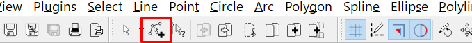

# README

This MR is a significant update that includes several new features alongside extensive internal changes, refactoring, and improvements.

**Content**:

<!-- TOC -->
* [README](#readme)
  * [Changes Overview](#changes-overview)
  * [Entities selection mode](#entities-selection-mode)
    * [Selection Mode Demo Video](#selection-mode-demo-video)
  * [Quick Selection (Conditional Entity Selection)](#quick-selection-conditional-entity-selection)
    * [Quick Selection Dialog](#quick-selection-dialog)
    * [Inexact Search for Floating-Point Properties](#inexact-search-for-floating-point-properties)
    * [Logical AND and OR Operations](#logical-and-and-or-operations)
      * [OR Operations](#or-operations)
      * [AND Operations](#and-operations)
    * [Quick Selection Summary - Efficiency Benefits](#quick-selection-summary---efficiency-benefits)
      * [Key Functional Advantages](#key-functional-advantages)
      * [Impact on Productivity](#impact-on-productivity)
    * [Select Quick Demo Video](#select-quick-demo-video)
  * [Properties Widget](#properties-widget)
    * [Invocation](#invocation)
    * [Widget Structure](#widget-structure)
    * [Toolbar Area](#toolbar-area)
    * [Property Sheet](#property-sheet)
      * [Properties Editors](#properties-editors)
      * [Read-Only Properties](#read-only-properties)
      * [Multiple Entities Editing](#multiple-entities-editing)
      * [Collapsing Sections](#collapsing-sections)
    * [Informational section](#informational-section-)
    * [Minimalistic Entity Properties](#minimalistic-entity-properties)
    * [Enhancing the Property Sheet](#enhancing-the-property-sheet)
    * [Dimensional Entities](#dimensional-entities)
    * ["No selection" mode](#no-selection-mode)
    * [Tool Options in Properties](#tool-options-in-properties)
    * [Property Sheet in Print Preview](#property-sheet-in-print-preview)
    * [Efficiency and User benefits](#efficiency-and-user-benefits)
    * [Efficiency Summary](#efficiency-summary)
      * [Summary:](#summary)
    * [Quick Start: Mastering the Properties Widget](#quick-start-mastering-the-properties-widget)
    * [Properties Widget Demo Video](#properties-widget-demo-video)
  * [Line Radiant Action](#line-radiant-action)
      * [Drawing Modes Comparison](#drawing-modes-comparison)
    * [Command line support](#command-line-support)
    * [Line Radiant Workflow Improvements:](#line-radiant-workflow-improvements-)
    * [Step-By-Step - 2 and 3 point Perspectives](#step-by-step---2-and-3-point-perspectives)
      * [Setting Up Two-Point Perspective](#setting-up-two-point-perspective)
      * [Setting Up Three-Point Perspective](#setting-up-three-point-perspective)
    * [Demo:](#demo)
  * [Visual Snap](#visual-snap)
    * [Visual Snap Overview](#visual-snap-overview-)
    * [Visual Snap Solution Lifecycle](#visual-snap-solution-lifecycle)
    * [Visual Snap Activation](#visual-snap-activation)
      * [Clearing Visual Snap solution](#clearing-visual-snap-solution)
    * [Visual Snap Structure](#visual-snap-structure)
      * [Guiding Entities](#guiding-entities)
      * [Guidinging Points](#guidinging-points)
    * [Guidinging Points](#guidinging-points-1)
      * [Adding Guiding Points](#adding-guiding-points)
      * [Automatic adding Snapped Points](#automatic-adding-snapped-points)
      * [Removing Guiding Points](#removing-guiding-points)
    * [Guiding Entities](#guiding-entities-1)
      * [Guiding Entities related to Guiding Points](#guiding-entities-related-to-guiding-points)
      * [Point-Point guiding lines](#point-point-guiding-lines-)
      * [Snap Middle - Lines and Vertexes](#snap-middle---lines-and-vertexes)
      * [Snap Distance - Distance guiding circles](#snap-distance---distance-guiding-circles-)
      * [Distance guiding circles tangentials](#distance-guiding-circles-tangentials)
      * [Adding Point-Point distances](#adding-point-point-distances)
    * [Document Entities in Visual Snap](#document-entities-in-visual-snap)
      * [Adding Entity to Visual Snap](#adding-entity-to-visual-snap)
      * [Removing Entity from Visual Snap solution](#removing-entity-from-visual-snap-solution)
      * [Specifics of Line Entities in Visual Snap](#specifics-of-line-entities-in-visual-snap)
      * [Specifics of Arc and Circle Entities](#specifics-of-arc-and-circle-entities)
      * [Orthogonals for entities](#orthogonals-for-entities)
    * [Explicit Guiding Entities](#explicit-guiding-entities)
      * [Absolute Point](#absolute-point)
      * [Relative Line](#relative-line)
      * [Relative Distance](#relative-distance)
      * [Relative Point](#relative-point)
    * [Visual Snap Settings](#visual-snap-settings)
    * [Snap Options Drop-Down in the Snap Toolbar](#snap-options-drop-down-in-the-snap-toolbar)
    * [Locking Visual Snap](#locking-visual-snap)
    * [Keyboard Support](#keyboard-support)
      * [Visual Snap Quick Reference](#visual-snap-quick-reference)
      * [Relative Input Shortcuts](#relative-input-shortcuts)
    * [Labels for Guding Entities](#labels-for-guding-entities)
    * [Visual Snap - Efficiency Benefits](#visual-snap---efficiency-benefits)
      * [Key Advantages for the User](#key-advantages-for-the-user)
      * [Impact on Productivity](#impact-on-productivity-1)
    * [Demo:](#demo-1)
  * [Generic Snap](#generic-snap)
      * [Angle Snap improvement](#angle-snap-improvement)
      * [Restriction lines](#restriction-lines)
      * [Snap mode Icons](#snap-mode-icons-)
  * [Relative Point Input Assistant](#relative-point-input-assistant)
      * [Base Point](#base-point)
      * [Coordinates Mode](#coordinates-mode)
      * [Relative Point Input Assistant Invocation](#relative-point-input-assistant-invocation)
      * [Keyboard Navigation](#keyboard-navigation)
      * [Closing the Assistant](#closing-the-assistant)
      * [Parameter Editor Controls](#parameter-editor-controls)
      * [Calculated Expressions](#calculated-expressions-)
      * [Calculation Priorities](#calculation-priorities)
      * [Settings](#settings)
      * [Actions Shortcuts](#actions-shortcuts)
      * [Quick Reference](#quick-reference)
      * [Workflow Example: Constructing a Precise Sloped Bracket](#workflow-example-constructing-a-precise-sloped-bracket)
    * [Relative Point Input Assistant - Efficiency Benefits](#relative-point-input-assistant---efficiency-benefits)
      * [Key advantages for the user](#key-advantages-for-the-user-1)
      * [Impact on Productivity](#impact-on-productivity-2)
    * [Demo:](#demo-2)
  * [Other UI Improvements](#other-ui-improvements)
    * ["All Tools" CAD Panel (Tools Matrix)](#all-tools-cad-panel-tools-matrix)
      * [Minor changes](#minor-changes)
      * [Workspace Improvements](#workspace-improvements)
      * [Separators in Custom Toolbars and Custom Menus](#separators-in-custom-toolbars-and-custom-menus)
      * [Selection actions in toolbar](#selection-actions-in-toolbar)
      * [Hideable Main menu.](#hideable-main-menu)
    * [Command-line Commands Informer](#command-line-commands-informer)
      * [Demo Video](#demo-video)
  * [Changes in Actions:](#changes-in-actions)
      * [Demo Video](#demo-video-1)
  * [Various internal refactorings](#various-internal-refactorings)
<!-- TOC -->

## Changes Overview
The most notable changes are:
1) Support for **selection** modes - additive/exclusive (https://youtu.be/D7AVkwOrGcI);
2) **Quick Selection** (conditional selection) of entities based on their properties (https://youtu.be/D7AVkwOrGcI);
3) **Property Sheet** widget that allows viewing and editing properties of selected entities (with support for **bulk editing**) (https://youtu.be/0iCLDneqFpg);
4) **Visual Snap** — visual snapping to entities using guiding lines, points, and circles (https://youtu.be/M8SBAofLU-Y);
5) **Relative Point Input Assistant** tool for fast coordinate entry (https://youtu.be/oyI51XT704k);
6) New "**Line Radiant**" action, which allows drawing lines radiating from specified center points (https://youtu.be/U-bK8C39DRw);
7) **Command-line Informer** — a small tool to inform the user about the command-line command for an invoked action;
8) UI improvements (hiding the Main Menu, combined CAD tools panel, and selection actions in the toolbar: https://youtu.be/MQbXXaxM66o);
9) Internal refactoring and code improvements;

These changes are described in the sections below.

## Entities selection mode

Entity selection has been expanded and now operates in two modes: Additive and Exclusive. 
This behavior is similar to the **PICKADD** system variable in AutoCAD.

- **Additive** Mode: When the user selects entities, they are added to the current selection set. This matches the legacy selection method in LibreCAD.
- **Exclusive** Mode: Newly selected entities replace the current selection, and any previously selected entities are automatically deselected.
Deselecting an entity removes it from the selection set, consistent with previous versions.

The selection mode toggle is now available in the "_Edit_" toolbar.

### Selection Mode Demo Video

Selection modes are covered by this video: https://youtu.be/D7AVkwOrGcI

## Quick Selection (Conditional Entity Selection)
It is now possible to select entities based on specific attribute values and conditional operators.

During the search, the tool examines entities of a specified type and matches their properties against a search value using the chosen operator.

### Quick Selection Dialog
A new action, _**Select Quick**_, has been added. When invoked, it opens a dialog where you can define search criteria.

The dialog includes the following sections:

1) **Apply To** – Defines whether the search should be applied to the entire document or only to the current selection.
2) **Entity Type** – Specifies which type of entities should be examined.
3) **Properties** – Selects the property to evaluate. The available properties depend on the selected Entity Type.
4) **Operator** – Defines how the property value is compared. The available operators depend on the property type:
   - = **Equals**: The property value must match the search value exactly.
   - <> **Not equals**: The property value must differ from the search value.
   - \> **Greater than**: (For integer and double properties) The value must be greater than the specified one.
   - < **Less than**: (For integer and double properties) The value must be less than the specified one.
   - **Select All**: Ignores the value; all entities of the specified type are accepted.

5) **Value** – The target value for the search. The input field adapts based on the selected property type.
6) **How to Apply** – Specifies whether matching entities should be Included in or Excluded from the selection set.
7) **Append to current selection set** – Determines if the matching entities should be added to the existing selection or if the existing selection should be replaced.
  
Once the dialog is confirmed, the entities that satisfy the conditions will be selected (or deselected) in the drawing.

### Inexact Search for Floating-Point Properties
The UI for specifying search values adapts to the selected property type and is usually straightforward.

However, for entity properties using floating-point types (such as X or Y coordinates), the Value section includes both a data entry field and a "_**Tolerance**_" field. 

By default, this field uses the current precision of the drawing.

Entering a value here enables an inexact search, matching properties within a specific **range**:
- **Lower bound**: Search Value - Tolerance
- **Upper bound**: Search Value + Tolerance

Effectively, for floating-point properties, this acts as a "Between" operator. 

This approach allows for queries such as:

`Find all circles with a center point X-coordinate between 100.0 and 200.0.`

`Find all lines starting at Y = 10.0 (plus or minus a specific tolerance).`

### Logical AND and OR Operations
_Quick Selection_ does not support matching multiple properties simultaneously; therefore, you cannot combine properties using logical operators in a single pass.
However, complex logic can be achieved through subsequent calls to the _Select Quick_ action.

#### OR Operations
Queries such as `Select CIRCLES where COLOR is RED OR LAYER is NOT 0` can be performed in two steps:
1) Invoke the action with the condition: `CIRCLES where COLOR is EQUAL to RED`.
2) Invoke the action again with the condition:` CIRCLES where LAYER is NOT EQUAL to 0`.

> **Note:** For the second step, ensure that "How to Apply" is set to "Include" and the "Append to current selection set" checkbox is enabled.
 
#### AND Operations
Queries such as Select `CIRCLES where COLOR is RED AND LAYER is NOT 0` can be emulated as follows:
1) Invoke the action with the condition: `CIRCLES where COLOR is EQUAL to RED`.
2) Invoke the action again with the condition: `CIRCLES where LAYER is EQUAL to 0` (the inverse of your target condition).

> **Note:** For the second step, set "How to Apply" to "**Exclude**" and ensure "**Append to current selection set**" is enabled.

This second pass will remove all circles on Layer 0 from your current selection, leaving only red circles that are **not** on Layer 0 — achieving the same result as a logical AND.

### Quick Selection Summary - Efficiency Benefits

The _Quick Selection_ and _Selection Modes_ features provide a logic-based approach to managing drawing data. These tools enable the user to control complex datasets with precision, especially when performing bulk attribute modifications.

#### Key Functional Advantages

*   **Logic-Based Filtering**  
    The _Select Quick_ tool enables the user to isolate entities based on properties like length, radius, layer, or color. This is significantly faster than manual selection in crowded or complex drawings.

*   **Facilitating Bulk Property Changes**  
    Once a specific set of entities is isolated, the user can apply bulk changes via the **Property Sheet**. This allows for the simultaneous update of coordinates, layers, or styles for the entire selection in a single operation.

*   **Precision Range Searching (Tolerance)**  
    The _Inexact Search_ uses a **Tolerance** value to select objects that are approximately aligned or within a specific geometric window. This is essential for auditing and correcting imported geometry.

*   **Flexible Selection Behavior**  
    The  **Exclusive** and **Additive** (PICKADD) modes allow the user to define how new selections interact with existing ones, making the construction of complex selection sets predictable and efficient.

#### Impact on Productivity

*   **Accelerated Auditing**: The user can quickly identify and correct entities that deviate from project standards.
*   **Simplified Global Updates**: Single queries replace repetitive individual edits, applying changes across the entire document at once.
*   **Refined Filtering**: Sequential **Include** and **Exclude** passes allow the user to narrow down selections using multiple criteria before executing mass edits.

In summary, these tools provide a structured method for handling mass data, ensuring that global modifications are both accurate and rapid.

### Select Quick Demo Video

Quick Selection is covered by this video: https://youtu.be/D7AVkwOrGcI

## Properties Widget

The Properties widget is a powerful new tool for inspecting and bulk-editing selected entities. 
Beyond standard editing, it acts as a dynamic control hub by integrating context-aware commands and centralizing various interface settings.

### Invocation

Like all other widgets, Properties can be enabled via the _Workspace → Widgets → Properties_ menu item.

### Widget Structure

The widget is organized into three main areas:
1) **Toolbar**: Selection tools and configuration settings.
2) **Property Sheet**: Collapsible sections for viewing and editing properties.
3) **Informational Area**: Descriptive details for the selected property.

### Toolbar Area

The toolbar includes selection tools, an _Entity Type combobox_, and a _Settings_ button. 
When multiple entity types are selected at once, the combobox allows for filtering the selection to display only the properties of a specific type. 

### Property Sheet
At the heart of the widget is the Property Sheet, which organizes properties into collapsible sections for easier navigation.

#### Properties Editors

Properties are categorized by type, such as strings, coordinates, or integers.

The Property Sheet uses specialized editors for each type. To begin editing, left-click the property or press **ENTER**.

Examples of editors include:

- **Coordinate**

   Allows for manual input or picking a value directly from the drawing.

  

- **Selection combobox** 

   Displays a dropdown list tailored to the specific property.

  

- **Checkbox**

  Used for toggling Yes/No or True/False values. 

  
 
- **Index selection**

    Facilitates editing of indexed elements, such as polyline vertices or spline fit points.

  

Similar editors exist for other types, including strings and integers. 

To aid navigation, the row of the currently focused property is always highlighted.

#### Read-Only Properties

Properties that cannot be modified are displayed in gray, and no editor is available.

For example, the length of a line is a calculated value and is read-only.

#### Multiple Entities Editing 

Depending on the current selection mode, multiple entities may be selected simultaneously. While some properties may share the same value (e.g., Layer or Pen), others may differ.

The Properties widget effectively manages these discrepancies: if values vary across the selection, the **(VARIES)** placeholder is displayed.

After a user finishes editing a property, the change is applied to **every entity** in the current selection. 

#### Collapsing Sections
Each section within the Property Sheet can be expanded or collapsed.

Section expansion states are persistent and are automatically restored when the Property Sheet is updated.

### Informational section 
An informational section is located at the bottom of the widget.

It displays the name of the selected property along with a description providing additional context and details.

The informational section supports resizing and collapsing. Users can adjust the area by dragging the top boundary to fit the content or hide the section completely. 

### Minimalistic Entity Properties

The Properties widget displays attributes specific to the selected entity type.

In its simplest form, the widget typically contains two sections:
1) General: Includes generic attributes common to all entity types (e.g., Layer and Pen).
2) Geometry: A set of geometric properties that depends on the selected entity type.
 

### Enhancing the Property Sheet
Several settings are available to control the content displayed in the Property Sheet. 

Clicking the _Settings_ button in the Properties widget toolbar invokes the settings dialog.

These settings affect the content displayed for selected properties:

 

* **Include command links** 

    When this option is enabled, context-specific command links are added directly to the property sheet. 

    

* **Show calculated properties**

    This option determines whether computed properties (such as the length of a line, the area of a circle, or the diameter of an arc) are displayed. 

    If enabled, an additional "_Calculated_" section appears.  

    

    These calculated properties are derived from entity data, are read-only, and cannot be edited.

* **Show single entity commands**

   When this option is enabled **and** only a **single** entity is selected, a "_Single Entity Actions_" section is displayed. 

    

    This section provides context-aware commands for the selected object.
    Upon invocation, the entity is passed directly to the command, eliminating the need for a manual selection step.
 
    This section remains hidden if multiple entities are selected.  

* **Show multiple entities modification commands**

  If selected, the property sheet includes a "_Selected Set Actions_" section.. 

   

    This section contains generic commands applicable to the entire selection set. The selected entities are automatically passed to the invoked command, bypassing the manual selection process.

    This section is visible for both single and multiple entity selections.

 
* **Show Tool Options** 

  If selected, the property show mya also include active tool options (duplicating the content of corresponding toolbar). 

### Dimensional Entities

For dimensions, the Property Sheet displays a combination of specific entity properties and **Dimension Style overrides**.

|    |    |
|---|---|

If no style override exists, the properties of the entity's current Dimension Style are displayed.

Modifying these values automatically creates a Dimension Style override for the selected dimension entities.

### "No selection" mode

When no entities are selected, the Properties widget displays a set of generic properties and commands.

In this mode, it centralizes access to drawing options (such as units or grid settings) and common operations usually found in various toolbars (e.g., Pen, Layer, and Edit).

This feature is specifically designed to support minimalist UI layouts. 

By provided aggregationg of the functionality of multiple UI elements into a single widget, users can hide redundant toolbars and maximize the available drawing area.

Any changes made here are reflected across the entire interface (for instance, updating properties in the Workspace or Graphic View sections). 

Users can customize which sections are visible in this mode via the _Properties Settings_ dialog.

### Tool Options in Properties

The Properties widget can also incorporate options for the active command, duplicating the functionality of the _Tool Options_ toolbar. 

This integration allows users to hide the dedicated toolbar and maximize screen space for the drawing area.

When an action is active, the widget's title changes to display the icon and name of the current task. 

Additionally, an _Action Options_ section is pinned to the top of the Property Sheet. The content of this section dynamically updates based on the requirements of the active command.

### Property Sheet in Print Preview

In Print Preview mode, the Properties widget displays additional sections relevant to printing:

### Efficiency and User benefits
The Properties widget is more than just a data viewer; it is a centralized command hub that fundamentally transforms the user experience.

### Efficiency Summary
By merging inspection, modification, and execution into a single interface, the widget directly impacts performance in several key ways:
1. **Maximized Focus and Screen Real Estate**
   The widget consolidates functionality from multiple toolbars (such as Tool Options, Drawing Settings, and Grid Controls) into one location.
   User Benefit: Users can hide redundant interface elements, reclaiming significant screen space for the drawing area. This minimizes visual clutter and allows for a "zen-like" workspace where the focus remains on the design.
2. **High-Speed Bulk Modifications**
   The intelligent handling of multiple selections—using the (VARIES) indicator and simultaneous value assignment—streamlines mass edits.
   User Benefit: Changing attributes for hundreds of entities takes the same amount of time as changing one. This eliminates the tedious, repetitive task of manual object-by-object editing, drastically reducing the time spent on revisions.
3. **"Zero-Step" Action Execution**
   Through context-aware sections like "Single Entity Actions" and "Selected Set Actions," commands are applied directly to current selections.
   User Benefit: This removes the traditional "call command then select object" workflow. By bypassing extra selection steps, the widget cuts down on "click fatigue" and speeds up the transition between thinking of a change and executing it.
4. **Dynamic Contextual Awareness**
   The widget "thinks" with the user. It automatically switches content based on the environment—showing print settings in Print Preview, command options during active tasks, or drawing units when nothing is selected.
   User Benefit: The most relevant tools are always at the user's fingertips. This eliminates the need to navigate deep menus or switch tabs, ensuring a fluid, uninterrupted creative flow.
5. **Real-Time Data Insight**
   The "Calculated Properties" section provides instant geometric feedback (like area, length, and diameter) without requiring manual measurement tools.
   User Benefit: Immediate access to derived data speeds up decision-making and verification, allowing users to validate their engineering constraints on the fly.

#### Summary:
   The Properties widget shifts the user experience from navigating software to executing design. It improves performance by reducing cognitive load, eliminating redundant clicks, and providing a clean, adaptive interface that scales with the complexity of the project.

---

### Quick Start: Mastering the Properties Widget
To start using the Properties widget effectively, follow these three simple steps:
1) **Open the Widget**: Navigate to _Workspace → Widgets → Properties_. Once opened, you can dock it to the side of your screen to keep it accessible throughout your session.
2) **Select & Inspect**: Click on any entity in your drawing. The widget will instantly populate with its properties. If you select multiple objects, use the Entity Type combobox at the top to filter specifically for lines, circles, or text.
3) **Edit Instantly**: Click on any highlighted property value to modify it. Press **ENTER** to apply the change. If multiple entities are selected, your new value is applied to all of them at once—instantly synchronizing your drawing.
---
### Properties Widget Demo Video

Demo video for Properties widget is located there: https://youtu.be/0iCLDneqFpg

## Line Radiant Action
The Line Radiant action is a specialized drafting tool designed to automate the creation of lines oriented toward predefined focal points. By managing directional constraints automatically, this tool significantly reduces the manual effort required for perspective drawing and radial layouts.

This is simple command that allows the user to draw a line from a specified point to one of four predefined radiant center points.

This action is useful for various purposes, such as simplifying perspective drawing.

The tool allows you to define the positions of the radiant points and specify which one is currently active.

The following drawing modes determine how the line length is handled:

- **Line**: Draws a line of a specified length starting from a provided point and directed toward the radiant center.
- **To Point**: Draws a line from a provided point directly to the radiant center point.
- **By X**: Draws a line where the specified length defines its projection onto the X-axis.
- **By Y**: Draws a line where the specified length defines its projection onto the Y-axis.
- **Free**: The user specifies both the start and end points. The line's direction is automatically constrained toward the radiant center point.

#### Drawing Modes Comparison

The following table details the behavior of each mode and its specific application in technical drafting:

| Mode | Technical Behavior | Drafting Application                                                                                                                                                                              |
| :--- | :--- |:--------------------------------------------------------------------------------------------------------------------------------------------------------------------------------------------------|
| **Line** | Draws a segment of a fixed, user-defined length toward the center. | **Uniform Detailing:** Placing consistent structural elements like rafters or studs. Adding repeatable elements like window frames or rafters with uniform depth.                                 |
| **To Point** | Extends the line from the start point directly to the radiant center. | **Construction Lines:** Establishing primary vanishing lines for perspective grids. Creating primary construction lines that meet at a single focal point.                                        |
| **By X** | The line length is calculated as a projection onto the X-axis. | **Horizontal Scaling/Floor Plans:** Aligning depth in plan views with horizontal grid increments. Drawing receding walls where the depth must align with a specific horizontal grid.              |
| **By Y** | The line length is calculated as a projection onto the Y-axis. | **Vertical Scaling/Elevation:** Maintaining scaled heights for receding vertical elements in elevations. Drawing heights of buildings or pillars in perspective while maintaining vertical scale. |
| **Free** | Constrains the line direction toward the center while allowing custom start and end points. | **Dynamic Sketching:** Creating non-standard architectural features within a constrained radiant framework. Sketching unique architectural features that don't follow a fixed length.             |

### Command line support

The _Line Radiant_ action can be invoked using the **radline** command.

The following commands are supported while the action is active:

- **length** — Sets the length parameter for the line.
- **lentype** — Specifies the length calculation mode. The supported values are:
- **line** — Line mode
  - **x** — By X mode
  - **y** — By Y mode
  - **point** — To Point mode
  - **free** — Free mode
- **active** — Sets the active radiant point by its index (1 to 4).
- **radiant** — Allows you to enter the coordinates for the radiant points.
 
### Line Radiant Workflow Improvements: 
* **Automated Geometry**: With up to four predefined radiant centers, the tool eliminates the need for manual angle calculations. Every line drawn is geometrically constrained to the active center point, ensuring 100% accuracy in perspective projections.
* **Contextual Projection Modes**: The variety of length modes allows users to handle different drafting requirements—such as axial projections (By X/Y) or fixed-depth segments—without leaving the command context.
* **Command-Line Integration**: Full support for the radline command and its sub-parameters (length, active, radiant) enables a high-speed, keyboard-driven workflow, which is essential for professional productivity.

---
### Step-By-Step - 2 and 3 point Perspectives

Line Radiant action may be used for drawing perspective lines. 

#### Setting Up Two-Point Perspective

To create a standard two-point perspective (e.g., for an architectural corner view), follow these steps to configure the radiant centers:

**1. Establish the Horizon Line**
Draw a horizontal line across your workspace to represent the **Horizon Line (HL)**. The placement of this line determines the viewer's eye level (High for a "bird's eye" view, Low for a "worm's eye" view).

**2. Define Radiant Centers (Vanishing Points)**
Invoke the **radline** command and use the `radiant` parameter to set your points on the Horizon Line:
*   **Point 1 (Left Vanishing Point):** Set this on the far left of the Horizon Line.
*   **Point 2 (Right Vanishing Point):** Set this on the far right of the Horizon Line.
*   *Tip: Placing these points further apart reduces extreme distortion in the drawing.*

**3. Toggle Between Points**
While the action is active, use the `active` command to switch focus:
*   Type `active 1` to draw lines receding toward the **left**.
*   Type `active 2` to draw lines receding toward the **right**.

**4. Construct the Vertical Edge**
Draw a standard vertical line (using the regular Line tool) to represent the closest corner of your building or object.

**5. Draw Receding Planes**
Switch to `radline` and choose your preferred length mode (e.g., `lentype free` or `lentype x`):
1.  Set `active 1` and click the top/bottom of your vertical edge to draw the left wall.
2.  Set `active 2` and click the same points to draw the right wall.

#### Setting Up Three-Point Perspective

Three-point perspective is used to represent tall structures viewed from a low or high angle, adding a third vanishing point to account for vertical convergence.

**1. Setup the Horizon and Lateral Points**
Establish your **Horizon Line** and set the first two radiant centers as you would for a two-point setup:
*   **Point 1 (Left Vanishing Point):** Use the `radiant` command to place this on the left side of the horizon.
*   **Point 2 (Right Vanishing Point):** Place this on the right side of the horizon.

**2. Define the Vertical Vanishing Point**
The third point is placed above or below the horizon line, typically centered between the first two:
*   **Point 3 (Vertical Vanishing Point):**
    *   Place it **high above** the horizon for a "Worm’s Eye" view (looking up).
    *   Place it **far below** the horizon for a "Bird’s Eye" view (looking down).

**3. Coordinate the Drawing Process**
Toggle between the active centers using the `active [index]` command to build the structure:
1.  **Vertical Edges (`active 3`):** Instead of drawing perfectly vertical lines, use the radiant tool with Point 3 active. All vertical corners of the building will now converge toward this top or bottom point.
2.  **Lateral Planes (`active 1` & `active 2`):** Use the first two points to draw the receding horizontal walls as usual.

**4. Manage Proportions with "Free" Mode**
In three-point perspective, traditional "By X" or "By Y" modes can be complex due to the tilt of all axes. Using **`lentype free`** is often the most efficient way to define custom heights and widths while ensuring the lines remain perfectly oriented toward the vertical radiant center.

---

### Demo:
Demo video for line radiant action is located there: https://youtu.be/U-bK8C39DRw
## Visual Snap

_Visual Snap_ is a new way to snap to specific points in a drawing.

It serves as an intelligent, dynamic coordinate assistant designed to streamline the drafting process. 
By interpreting the natural geometry of existing elements, it reduces the need for manual calculations and the construction of auxiliary geometry.

Based on the natural geometry of drawing elements (lines, points, intersections, and circles), _Visual Snap_ allows users to select points using geometric characteristics—similar to functionality offered by AutoCAD or ArchiCAD.

How it works:
1) First, a set of guiding entities is created.
2) Snapping is performed to points on these entities (or their intersections) to calculate the desired snap point. 

These guiding entities are displayed as a drawing overlay.

With _Visual Snap_, you can snap to:
- Entities
- Infinite lines (vertical, horizontal, tangential, orthogonal, or at specific angles)
- Intersection points
- Middle points
- Distances

The following image illustrates a snap to a point located at a specific distance from an entity's endpoint, while also being aligned vertically (sharing the same X-coordinate) with that endpoint.

For snapping to specific types of points (like intersections or endpoints), _Visual Snap_ relies on oridinary snap methods. Therefore, enabling/disabling snap modes affects _Visual Snap_ too. 

### Visual Snap Overview  
The **Visual Snap** mechanism allows for the identification and snapping of several types of geometric points.

These points are essentially the "solutions" to intersections or constraints created by the temporary guiding entities.

Here are example of some types of points that may be snapped and their geometric meanings:
1. **Advanced Intersection Points**
   - **Orthogonal Intersection** (**X**/**Y**): A point sharing the X-coordinate of one guiding point and the Y-coordinate of another (perfect horizontal/vertical alignment).
   - **Ray-to-Entity Intersection**: The point where a guiding ray (like a Tangential **T** or Normal **N** ray) intersects an actual document entity (like an Arc or Circle).
   - **Double Tangency Point**: The intersection of two tangential rays (**T1**, **T2**) originating from different base entities.
   - **Normal-to-Ray Intersection**: The point where a perpendicular ray (**O** or **pp0**) meets another guiding line.
2. **Derived Middle Points**
   - **Virtual Midpoint**: The geometric center of a virtual line (pp) connecting two arbitrary guiding points.
   - **Segment Division Points**: When Snap Middle is configured for multiple segments, these are the points dividing the distance between two guiding points into equal parts.
   - **Entity Midpoint**: The center of a line or arc segment that has been added to the Visual Snap solution (marked with an x).
3. **Distance and Equidistant Points**
    - **Fixed Offset Point**: The intersection of a guiding ray and a distance circle (**~**), representing a point at a specific user-defined distance from a vertex.
   - **Equidistant Transfer Point**: The intersection of dynamic distance circles (**~V**). This allows the user to find a point that is exactly as far from Point B as Point B is from Point A.
   - **Tangent-to-Distance Intersections**: Points on the **T~** labels, which allow snapping to lines that maintain a specific clearance (offset) from virtual connections.
4. **Projection and Alignment Points**
    - **Angular Alignment Point**: A point located at a specific angular increment (e.g., 15°, 30°) relative to either the global axes (**/**) or a specific line entity (**<**).
    - **Collinear Extension**: A point located on the infinite extension (**L**) of an existing line segment.
    - **Orthogonal Projection**: The point where a perpendicular line from the center of one entity meets the boundary or center of another (**O**).

### Visual Snap Solution Lifecycle

In most cases, _Visual Snap_ is a temporary helper.

It activates when a specific action is invoked and expects input of point coordinates - and remains available until that action is finished or the user explicitly clears the snap data.

However, you can also **lock** the state of Visual Snap to share it across multiple actions.

### Visual Snap Activation

_Visual Snap_ is activated when:
1) The active command requires the user to enter or select a point (e.g., specifying the first or second point in the _Line by 2 points_ command).
2) **AND** _Visual Snap_ is globally enabled in the _Snap Toolbar_.

#### Clearing Visual Snap solution

An existing Visual Snap solution can be cleared in several ways:

1) Clear the entire solution
- **ESC**
- **CTRL + Middle Mouse Button Click**
- **Right Mouse Button Click** (optional)
2) Remove the last addition (point or entity)
- **Shift + ESC**
- **CTRL + Right Mouse Button Click**
3) Remove a drawing entity from the solution
- **CTRL + Hover**: Hold the cursor over the entity with a short delay.
4) Remove a guiding point
- **CTRL + Hover**: Hold the cursor over the point with a short delay.

Of course, both adding and removing guiding entities and points works only if _Visual Snap_ is **not locked**.

### Visual Snap Structure

To determine potential snap points, Visual Snap solves the set of contraints. 
These constraings are defined by user-specified guding points or guiding entities. 

#### Guiding Entities

The types of guiding entities are:
1) Point
2) Infinite Ray (similar to a construction line)
3) Circle
4) Drawing Entity (line, circle, or arc from the document)

A guiding entity can be added to the _Visual Snap_ solution either as a temporary entity (created automatically by the _Visual Snap_ logic) or by including an existing entity from the drawing.

#### Guidinging Points

Guiding points are created by either:
1) Snapping to existing points.
2) Adding drawing entities to _Visual Snap_.
3) Adding guiding points to _Visual Snap_ explicitly by the user.

### Guidinging Points

Guiding points used to define vertical, horizontal, angular and distance contstraints. 

Also,in conjunctions with entities, they are used for defining perpendiculats (normal) and tangentials constrants. 

#### Adding Guiding Points

Guiding points can be added to Visual Snap in several ways:

1) **Explicitly**: By pressing the **TAB** key. The current snap point at the mouse position will be added as a guiding point.
2) Via standard snap operations: (e.g., endpoint, intersection, center, etc.). To add such a point, hover the cursor over it and wait for a pre-defined delay.

    Depending on settings, the point will be added if:
 
   - The cursor stays **over the point** for a specified duration.
   - The cursor stays **over the point** for a specified duration **AND** the **CTRL** key is pressed.

The following picture illustrates guiding point created for endpoint of line. 
 

#### Automatic adding Snapped Points
Based on settings, points that were previosuly selected by the user points may be added to _Visual Snap_ Solution automatically (like vertexes of created polyline or vertexes of lines).

If this is disabled - guiding points should be added manually.

This behavior is controlled by _Application Preferences -> Snap -> Visual Snap -> Visual Snap Behavior_ settings (see below).

#### Removing Guiding Points

To remove a guiding point from the _Visual Snap_ solution:

* Hover the mouse cursor over the point while holding **CTRL** and wait for delayed removal.
* Use **CTRL + Right Mouse** Button click.

Adding or removing a guiding point provides visual feedback by highlighting the point on the drawing.

### Guiding Entities

Guiding entities may be added to Visual Snap solution either automatically, as result of adding guiding points, or explicitly, by ading entities from the document. 

#### Guiding Entities related to Guiding Points

For each guiding point, several additional guiding entities are typically created. Depending on settings, a corresponding label may be displayed for each entity type. These labels are shown below in parentheses **()**:

1) Vertical ray (**Y**);
2) Horizontal ray (**X**);
3) Angle step rays — if enabled in the options, this creates a set of lines with absolute angles calculated based on the angle snap settings (**/**).
4) Distance circles (**~** or ~**V**)

If a guiding point represents the endpoint of a line or arc, additional guiding entities are created:
1) Tangential line (**T**)
2) Normal line  (**N**)

For a line endpoint, a ray following the line's direction (**L**)is also created .

#### Point-Point guiding lines 
As soon as guiding points are added to the Visual Snap solution, a guiding lines between them are also considered. 
_Snap to Middle_ and _Snap to Distance_ contraints are applied to them, so it will be possible, for example, support "_Snap Middle_" mode as part of _Visual Snap_.

More details about this are below.

#### Snap Middle - Lines and Vertexes

Points calculated by _Snap Middle_ are also supported by _Visual Snap_. 

These points are located either on the guiding lines that connect Guiding Points (**V**) included in _Visual Snap_, or on line entities that are already part of the _Visual Snap_ solution.

Middle points are marked with a **x** marker. Regardless of amount middle points specified for **Snap Middle**, geometrical middle point for line is always added. 

> **Note:** Middle points and guiding lines that connect guiding points (**pp**) are created only when the _Snap Middle_ mode is active.

#### Snap Distance - Distance guiding circles 
If _Snap to Distance_ mode is enabled, guiding circles will be created with a radius equal to the "Snap Dist" parameter. 

Guiding circles for distances are marked with a "**~**" symbol.

#### Distance guiding circles tangentials
If _Snap to Distance_ and _Snap Center_ modes are enabled, and, 
_Application Preferences | Snap | Visual Snap | Visual Snap Content | Tangential rays for distance circles_ settings is enabled, 
additional tangential rays between distance circles will be created.

This setting is also toggled by **Show Distance Tangentials** action in _Snap Toolbar_ _Visual Snap_ drop-down.

This snap mode allows you to snap to points that are equidistant from the lines connecting the guiding points.

Such tangential lines are marked with a **T~** label. 

#### Adding Point-Point distances

If enabled in the settings, guiding circles with a diameter equal to the distance between guiding points will also be included in the _Visual Snap_ solution. 

This allows you to snap to equidistant points.

Dynamic distance circles are marked with a **~V** label.

This is controlled by _Application Preferences | Snap | Visual Snap | Visual Snap Content | Dynamic Distance circles for point_ option (see below) and
**Show Dynamic Ditance Circles** action in _Snap Toolbar_ _Visual Snap_ drop-down.

> **Note:** Guiding cicles are created only if _Snap Distance_ snap mode is enabled.

### Document Entities in Visual Snap

Existing document entities can be included in _Visual Snap_.

Entities that are part of _Visual Snap_ are highlighted with the color specified in:
_Application Preferences -> Snap -> Visual Snap -> Involved document entities_.

#### Adding Entity to Visual Snap

To add an entity to the _Visual Snap_ solution, hover the cursor over it for the duration specified in the preferences. 

Once included, the entity is drawn in the color defined in the settings.

Supported entity types are:
1) Line
2) Arc
3) Circle

Entities may be atomic or be part of polyline.

#### Removing Entity from Visual Snap solution
To remove an entity from _Visual Snap_:
1) **Specific entity**: Hover the cursor over the entity while holding the **CTRL** key.
2) **Last addition**: Press **CTRL + Right Mouse Button** or **Shift + ESC**.

#### Specifics of Line Entities in Visual Snap

When a line entity is added to the _Visual Snap_ solution, the following guiding entities are created:

1) Vertex guiding points: Based on the X and Y coordinates of the endpoints (**X**, **Y**).
2) Directional ray: A ray following the line's direction (**L**).
3) Normal rays: Rays originating from the start and end points of the line, directed perpendicular (normal) to the line's direction.
4) Distance guiding circles: Created if _Snap to Distance_ mode is enabled (**~**).
5) Snap Middle markers: Created if _Snap Middle_ mode is enabled (**pp**).
6) Angle rays: If enabled in the options, a set of rays is created at specific angles relative to the line, defined by the Angle Step value (**<** and **/**).

#### Specifics of Arc and Circle Entities

For Arc and Circle entities, the following guiding points and lines are added:

**Arc** endpoints: 
Includes guiding points for coordinates (**X**, **Y**), as well as Tangential (**T**) and Normal (**N**) lines.

**Center** point: Includes guiding points for the center coordinates (**X**, **Y**).

Additionally, the following tangential and orthogonal rays are created:
- **T1**: Tangential rays from all existing guiding points to arcs and circles.
- **T2**: Tangential rays between each pair of arcs/circles (external and internal tangents).
- **O**: Orthogonal rays (center-to-center lines) connecting the center points of entities.
#### Orthogonals for entities
For document entities, added Visual Snap Solution, orthogonals rays from guiding points (**O**) to entities are also created.

### Explicit Guiding Entities

While most guiding entities are created automatically by Visual Snap, you can also explicitly create guiding entities at the current mouse position.

There are several ways (Line, Circle, and Point) to create guiding entities relative to the last snapped point. 

If no snap point has been defined during the current command invocation, the Relative Zero position is used as the last snapped point.

Unlike automatically created guiding entities, which only appear when the mouse is nearby, explicitly added guiding entities are always visible.

#### Absolute Point
An absolute guiding point is created by pressing the **TAB** key.

This adds a new guiding point and its related guiding line entities at the current snap position.

This position is determined by the snapping logic and is marked by the Snap Indicator, which may differ from the actual mouse cursor position.

#### Relative Line

The default shortcut is **SHIFT+L**.
Using the base point and the current mouse position, this command creates: 

1) Line ray between the points (**@L**)
2) Normal (perpendicular line) at the current mouse position relative to the line ray (**@N**)

#### Relative Distance

The default shortcut is  **SHIFT+C**

Creates a guiding circle (**@~**) with its center at the base point and a diameter equal to the distance between the base point and the target point.

#### Relative Point

Default shortcut is **SHIFT+P**

This command combines the features of relative line and relative distance. It creates:

1) Guiding circle: Centered at the base point with a diameter equal to the distance between the base point and the target point (**@~**).
2) Line ray: A ray connecting the base and target points (**@L**).
3) Normal: A line perpendicular to the line ray at the current mouse position (**@N**).
4) Vertical ray: An infinite vertical line passing through the current mouse position (**@Y**).
5) Horizontal ray: An infinite horizontal line passing through the current mouse position (**@X**).

### Visual Snap Settings
Various settings on the _Application Preferences | Snap_ tab control different aspects of _Visual Snap_ behavior and appearance.

Most of these options are quite straightforward (each input field includes a tooltip with additional details).

However, the following are worth mentioning:

**1) Show not snappable guiding entities**
When guiding entities are created, they are evaluated based on their distance from the current mouse position.
- If this option is **disabled**: Only guiding entities within snap range are shown.
 

- If this option is **enabled**: All possible guiding entities are displayed, including those far from the mouse position that cannot be snapped to.
 
> **NOTE:** If Visual Snap includes too many points and entities, the drawing area can become cluttered and performance may slow down. If this happens, disable the option.    
 
 

**Note**: Snappable guiding lines use a denser dotted pattern than non-snappable ones.

In the _Snap Toolbar_ drop-down, the item "**Show Far Guides**" toggles this setting.

**CAUTION:** Enabling far guides can cause visual clutter if many points and entities are included in _Visual Snap_.

**2) _Add snapped point to Visual Snap automatically_**
If enabled, any point snapped via a mouse click is automatically added to _Visual Snap_ as a guiding point.

The image above illustrates how all points snapped while drawing lines were added to _Visual Snap_. 

In the I drop-down, the item "**Add Snap Points**" toggles this setting.

**3) _Only add guides for last_**
If enabled, only the most recently snapped point is automatically added as a guiding point; any previously added points are removed.

The image above shows that only the final point of the operation remains in _Visual Snap_.

In the _Snap Toolbar_ drop-down, the item "**Add Last Snap Only**" toggles this setting.

**4) _Step Rays for guiding points_**
When enabled, a set of guiding rays is created for each guiding point. The angles of these rays correspond to the Angle Snap step value (e.g., 0°, 15°, 30°, 45° if the step is 15°).

Only the closest snappable ray is shown, regardless of the "**Show Far Guides**" or _Show not snappable guiding entities_ setting. 

These rays are labeled with **/**.

In the Snap Toolbar drop-down, the item "**Show Angle Rays**" toggles this setting.

**5) _Relative step rays for lines_**

This option is similar to the one above but applies to line entities added to **Visual Snap**.

If enabled, a set of guiding rays is created for line entities.

The increment between rays matches the Angle Snap step value. However, the 0° angle corresponds to the direction of the line itself, making all angles relative to that entity.

Only the closest snappable ray is shown, regardless of the "**Show Far Guides**" setting.

These rays are labeled with **<**.
In the Snap Toolbar drop-down, the item "**Show Angle Relative Rays**" toggles this setting.

**6) _Dynamic Distance circles for points_**
If this option is enabled, a set of dynamic distance circles will be created.

The center of each circle is located at a corresponding guiding point. 

The radius of each circle is equal to the distance between its center point and another guiding point.

Effectively, two circles are created for every pair of guiding points.

These circles allow you to snap to points at equidistant intervals.

These circles are labeled with **~V**.

In the Snap Toolbar drop-down, the item "**Show Dynamic Distance Circles**" toggles this setting.

**CAUTION**: If many guiding points are added to **Visual Snap**, enabling this option may lead to visual clutter and performance degradation.

### Snap Options Drop-Down in the Snap Toolbar

For faster access, a set of actions to toggle the options found in _Application Preferences -> Snap -> Visual Snap_ has been included in the Snap Toolbar.

These actions are located in the drop-down menu of the Visual Snap toggle button.

### Locking Visual Snap
In most cases, **Visual Snap** is considered a short-lived dynamic assistant.

It is activated only when the current command requires the user to specify point coordinates. 

By default, the solution is completely cleared as soon as the action finishes its execution (regardless of whether it was completed normally or cancelled by the user).

However, it is sometimes useful to share a specific set of guiding points and entities across several different actions. 

In this mode, Visual Snap acts as a feature complementary to "construction" layers.

To achieve this behavior, the state of Visual Snap can be "**locked**".

When locked, **no** guiding points or entities can be **added** or **removed** until it is **unlocked** again, and thus subsequent actions will use the existing guiding entities and points.

The action to lock/unlock Visual Snap is located in the Snap Toolbar's drop-down menu and is named "**Toggle Snap Visual Lock**".

Note that in the locked state, the main _Visual Snap_ icon changes to reflect its status.

### Keyboard Support
In addition to the shortcuts described above, several actions are related to _Visual Snap_.

These are primarily used to toggle specific options or to lock the snap state.

Keyboard shortcuts for these actions can be managed through the standard Shortcut Management settings:

#### Visual Snap Quick Reference

| Action | Shortcut / Method                                                            | Description |
| :--- |:-----------------------------------------------------------------------------| :--- |
| **Enable/Disable** | Snap Toolbar Button                                                          | Globally toggles the Visual Snap mechanism. |
| **Add Guiding Point** | **TAB**                                                                      | Adds a guiding point at the current snap indicator position. |
| **Add via Hover** | **Mouse Hover (+ CTRL)**                                                     | Adds a point/entity by hovering over it (delay is configurable). |
| **Clear All** | **ESC** or **CTRL+Mouse Middle Button**, **Right Mouse Button** (optionally) | Removes all temporary guiding entities and points. |
| **Undo Last** | **Shift + ESC**                                                              | Removes only the most recently added guiding point or entity. |
| **Remove Specific** | **CTRL + Hover**                                                             | Removes a specific entity or point from the solution after a delay. |
| **Lock Solution** | Toolbar Drop-down                                                            | Keeps the current guides active for use in subsequent commands. |

#### Relative Input Shortcuts

| Shortcut | Name | Resulting Guides |
| :--- | :--- | :--- |
| **Shift + L** | **Relative Line** | Creates a ray between base and mouse, plus a normal (**@L, @N**). |
| **Shift + D** | **Relative Dist** | Creates a circle centered at the base point with a dynamic radius (**@~**). |
| **Shift + P** | **Relative Point** | Creates a full set: Circle, Line Ray, Normal, and X/Y rays. |

### Labels for Guding Entities

The list below describes the labels used for guiding entities:

- **X** - **Horizontal** - Ray from a point parallel to the X-axis.
- **Y** - **Vertical**  - Ray from a point parallel to the Y-axis.
- **pp** - **Point-Point** - Ray connecting two guiding points.
- **pp0** - **Point-Point Orthogonal** - Ray orthogonal to the line between two guiding points.
- **O** - **Orthogonal** - Ray orthogonal to an entity included in Visual Snap.
- **/** - **Angle Ray** -  Ray from a guiding point at an angle based on the Angle Snap step.
- **<** - **Relative Angle Ray** - Ray from an endpoint at an angle relative to its parent line, based on the Angle Snap step.
- **T** - **Endpoint Tangential** - Ray from an endpoint that is tangential to its parent line or arc.
- **N** - **Endpoint Normal** - Ray from an endpoint that is normal (perpendicular) to its parent line or arc.
- **T1** -**Tangential One** - Tangential ray from a guiding point to an arc or circle.
- **T2** -**Tangential Two** - Tangential ray between two arc or circle entities.
- **M** - **Middle** - Middle point between points.
- **~** - **Distance (Explicit)** - Guiding circle for the "Snap Distance" mode.
- **~V** - **Distance (Point)** - Dynamic distance guiding circle built between two points (radius equals the distance between them).
- **T~** - **Tangential Distance (Explicit)** - Ray tangential to two explicit distance guiding circles.
- **@~** - **Relative Distance** - Relative distance guiding circle (between base and relative points).
- **@N** - **Relative Normal** - Normal ray to the line between base and relative points (at the relative point).
- **@<** - **Relative Angle** - Angle step ray at the relative point.
- **@X** - **Relative X** - Horizontal ray at the relative point.
- **@Y** - **Relative X** - Vertical ray at the relative point.
- **!X** - **Restriction Horizontal** - Horizontal restriction line at the Relative Zero point.
- **!Y** - **Restriction Vertical** - Vertical restriction line at the Relative Zero point.

### Visual Snap - Efficiency Benefits

In summary, Visual Snap bridges the gap between basic snapping and full-scale geometric construction, acting as a proactive assistant that anticipates the user's needs for precision and alignment.

#### Key Advantages for the User
* **Elimination of Manual Construction Lines**
  Traditionally, finding complex points (such as the intersection of a tangent or a specific offset) requires drawing temporary lines that must later be deleted. 
  _Visual Snap_ generates these as a non-destructive overlay, keeping the document workspace clean and focused.
* **Dynamic Geometric Inference**
  The system automatically suggests logical geometric relationships as you move the mouse. 
  It identifies horizontal/vertical alignments, tangential rays, and normal projections in real-time, allowing you to "discover" snap points that would otherwise require multiple steps to define.
* **Seamless Multitasking with "Locking"**
  The ability to Lock a **Visual Snap** solution transforms it into a temporary construction template. 
  This allows a specific set of guiding points to be reused across different commands (e.g., drawing a line, then a circle, then a hatch), ensuring perfect consistency across multiple operations.
* **Advanced Spatial Constraints**
  Features like Dynamic Distance Circles (~V) and Snap Middle (pp) enable users to perform complex spatial tasks—such as finding the exact midpoint between two unrelated objects or transferring a
  specific distance across the drawing—without ever opening a calculator or using a separate measurement tool.

#### Impact on Productivity
* **Reduced Command Input**: Users spend less time switching between construction tools and drawing tools.
* **Improved Accuracy**: By relying on mathematically generated rays and circles, the risk of "near-miss" errors during complex snapping is significantly minimized.
* **Faster Iteration**: The "temporary" nature of the assistant means users can explore different alignments and intersections instantly, speeding up the early stages of a design.

### Demo:
Demo video for visual snap is located there: https://youtu.be/M8SBAofLU-Y

## Generic Snap

The following minor changes have been introduced to generic snap behavior:

#### Angle Snap improvement

In general, _Angle Snap_ can conflict with _Snap to Grid_ modes. Previously, _Angle Snap_ was automatically disabled whenever a grid snap mode was active.

This constraint has been relaxed. The behavior of **Angle Snap** when used alongside **Snap to Grid** now depends on the settings found in the _Application Preferences | Snap tab_:

When _Angle Snap_ is invoked during point selection (typically by holding the **SHIFT** key): 

1) If **allowed** by settings: _Angle Snap_ will attempt to snap to the nearest point on a grid cell line while maintaining the required angle. Depending on the mouse position, it will snap to the intersection with either a vertical or horizontal grid line.
 
2) If grid snapping is **not allowed**: **Angle Snap** will operate in Ortho mode. It will apply either a horizontal or vertical restriction based on the current mouse position.

#### Restriction lines
When _Visual Snap_ is enabled, any active snap restrictions (vertical or horizontal) will now be displayed as restriction lines on the drawing.

#### Snap mode Icons 

A simplified version of the snap icons has been added. These icons are designed to be cleaner and easier to read (by my subjective opinion, of course).

## Relative Point Input Assistant

In LibreCAD, there are many situations where the user is prompted to enter a point location.

Often, it is simpler to specify coordinates relative to a base point.

For example, when entering the second point of a line, it is often convenient to use a relative angle and length, or a relative offset from the starting point.

The _Relative Point Input Assistant_ is a new specialized tool that simplifies this process by supporting in-place editing of point parameters.

It is designed to bridge the gap between manual mouse drafting and command-line input, by allowing the user to define point parameters in real-time without diverting attention away from the drawing area.

#### Base Point
The assistant uses the last point snapped by the currently active action as the Base Point.

If no such point exists, _Relative Zero_ point is used instead.

#### Coordinates Mode
The assistant supports several ways to enter coordinates:

1) **Relative Polar** - For specifying relative point by angle and distance from the base point; 
2) **Relative Cartesian** - For specifying relative point offset by X and offset by Y from the base point;
3) **Absolute Mode** -  For specifying relative point by absolute X and Y coordinates. 

Additionally, combinations of parameters are supported and resolved (e.g., specifying Distance + Offset X, or Angle + Offset Y).

To switch between Relative (Offset) and Absolute modes, use the dropdown menu or press the **T** key.

#### Relative Point Input Assistant Invocation

The assistant is invoked via keyboard shortcuts, which can be customized in _Options -> Keyboard Shortcuts -> Relative Points Assistant_.

Default shortcuts:

1. **SHIFT+D** - Relative by Distance

2. **SHIFT+A** - Relative by Angle

3. **SHIFT+X** - Relative by X offset

4. **SHIFT+Z** - Relative by Y offset

5. **SHIFT+G** - Absolute X

6. **SHIFT+B** - Absolute Y

When invoked, the assistant appears near the current mouse position and displays:

1) Base point coordinates.
2) Projected point coordinates (the result).
3) A toggle for Coordinate Mode (Relative/Absolute).
4) A set of parameter editors (Distance, Angle, etc.). 

Based on the way of invocation, corresponding editor for coordinate parameter will be activated.
#### Keyboard Navigation

The assistant is designed for high-speed input and fully supports keyboard control: 

Navigation:
- **TAB**, **KEY_DOWN** - Switch to next editor
- **SHIFT+TAB**, **KEY_UP** - Switch to previous editor
- **D** - Activate Distance editor
- **A** - Activate Angle editor
- **X** - Activate Offset by X or Absolute X editor
- **S** - Activate Offset by Y or Absolute Y editor
- **T** - Toggle between Offset/Absolute coordinates mode
- **P** - Pick an input value directly from the drawing.
- **Q** - Manual point selection (adds parameters to Visual Snap if active).
- **F** or **ENTER** - Complete editing and send coordinates to the active command.
- **ESC** - Cancel editing.

Available keyboard shortcuts are also duplicated in tooltip:

#### Closing the Assistant

While the assistant is active, you can still zoom or pan the drawing, though the active command is suspended.

* **Click outside the assistant**: Closes the assistant and returns to the command. 
* **Move mouse outside drawing area**: Hides the assistant.
* **ENTER**: Confirms the point.
* **ESC**: Cancels the input.
* **Entering a command in the Command Widget**: Closes the assistant.

#### Parameter Editor Controls

Each editor field includes (from left to right):

These controls are (from left to right):
1) An icon and label describing the parameter.
2) An **input** field for the value.
3) A **Pick** button to get values (distance, angle, or coordinate) from the drawing.
4) An **Apply** button to complete editing and return the coordinate.
5) A **Manual Select** button to specify a point on the drawing and add it to Visual Snap.
#### Calculated Expressions 

As most of other inputs that accepts value, line inputs within Relative Input Assistant fully supports calculated expressions. 

So it's possible to enter expression directly into the input fields, and result of calculation will be used.

Negative values of parameters are also supported. 

#### Calculation Priorities

When invoked, the assistant starts with current coordinatates of snapped point and all parameters are calculated.

If you provide more parameters than necessary to define a point, the assistant uses a priority system:
* When you explicitly enter a value, the field is marked with an exclamation mark (!).
* Explicitly entered values have higher priority than calculated ones.

 For example, Angle generally has higher importance than Length. 
 If you enter an Offset X value, the assistant will find the point that lies on the line with the specified Angle AND the provided Offset X, adjusting the length automatically.

In some cases, entered parameters may be overriden by calculated ones.

#### Settings

Settings for appearance and behavior can be found in _Application Preferences | Informational Cursor | Relative Point Input Assistant_ and thye are quite self-explanatory.

#### Actions Shortcuts
Keyboard shortcuts can be customized in _Options -> Keyboard Shortcuts -> Relative Points Assistant_.

Default shortcuts are shown below:

#### Quick Reference

**1) Invocation**

| Action | Key | Description |
| :--- | :--- | :--- |
| **Invoke (Distance)** | **SHIFT + D** | Activates the assistant with the Distance field focused. |
| **Invoke (Angle)** | **SHIFT + A** | Activates the assistant with the Angle field focused. |
| **Invoke (Offset X)** | **SHIFT + X** | Activates the assistant with the Offset X field focused. |
| **Invoke (Offset Y)** | **SHIFT + Z** | Activates the assistant with the Offset Y field focused. |
| **Invoke (Abs X)** | **SHIFT + G** | Activates the assistant with the Absolute X field focused. |
| **Invoke (Abs Y)** | **SHIFT + B** | Activates the assistant with the Absolute Y field focused. |

**2) Navigation & Controls**

| Command | Key | Description |
| :--- | :--- | :--- |
| **Toggle Mode** | **T** | Switch between Relative (Offset) and Absolute coordinate modes. |
| **Next Field** | **TAB** or **↓** | Move focus to the next input parameter. |
| **Prev Field** | **SHIFT + TAB** or **↑** | Move focus to the previous input parameter. |
| **Pick Value** | **P** | Capture distance or angle directly from the drawing. |
| **Manual Pick** | **Q** | Specify point on screen and add to Visual Snap. |
| **Confirm** | **ENTER** or **F** | Complete editing and return point to the active command. |
| **Cancel** | **ESC** | Close the assistant without providing a point. |

---
#### Workflow Example: Constructing a Precise Sloped Bracket

Imagine you need to draw a line starting from an existing corner with a length of **150 units** at an angle of **37.5 degrees**, but you also need its endpoint to align exactly with a vertical reference at **X = 500**.

Using the **Relative Point Input Assistant**, the workflow is as follows:

1.  **Start the Command**: Run the `Line` command and click the starting corner.
2.  **Invoke the Assistant**: Press **Shift + A** (Relative Angle). The assistant appears at your cursor with the Angle field active.
3.  **Set the Angle**: Type `37.5` and press **TAB**. The angle is now locked (marked with **!**).
4.  **Define the Alignment**: Press **Shift + G** (Absolute X). The editor switches to Absolute mode and focuses on the X-coordinate.
5.  **Enter Target Coordinate**: Type `500`.
6.  **Review the Result**: The assistant automatically calculates the required **Length** and **Y-offset** to satisfy both your fixed angle (37.5°) and the specific X-coordinate (500).
7.  **Confirm**: Press **Enter**. The point is placed with mathematical precision.

**Why this is faster:**
* **No Auxiliary Lines**: You don't need to draw infinite lines or find intersections manually.
* **No Trigonometry**: The assistant solves the geometry for you.
* **Immediate Feedback**: You see the projected point on the screen before you commit to the action.
 
---
### Relative Point Input Assistant - Efficiency Benefits

Relative assistant bridge the gap between manual mouse drafting and command-line input, by allowing the user to define point parameters in real-time without diverting attention away from the drawing area.

#### Key advantages for the user

* **In-Place Data Entry**: The assistant appears directly next to the cursor, enabling the entry of values (distance, angle, or offset) without the need to look away at the command line or parameter panels.
* **Dynamic Geometric Solving**: The tool automatically calculates a point's position based on any combination of parameters. For example, a user can lock only the angle and the X-offset, and the system will solve for the resulting distance and Y-coordinate.
* **Seamless Integration with Visual Snap**: Instead of typing raw numbers, the user can "capture" values—such as a specific length or angle—directly from existing drawing elements using the **Pick** buttons and immediately apply that data to the new point.
* **Unified Coordinate Management**: The ability to instantly toggle between Polar, Cartesian, and Absolute modes (via the **T** key) allows the user to adapt to any source data instantly.

#### Impact on Productivity

*   **Keyboard-Driven Speed**: Full support for keyboard navigation (TAB, Enter, and field-specific shortcuts) enables experienced users to input complex point sequences significantly faster than traditional methods.
*   **Elimination of Mental Arithmetic**: Support for mathematical expressions within input fields removes the need for the user to perform calculations manually before entering data.
*   **Reduced Context Switching**: Because the assistant automatically uses the last snapped point as the base, constructing complex contours becomes a continuous, logical workflow.

### Demo:

Demo video that illustrates _Relative Point Input Assistant_ is located there: https://youtu.be/oyI51XT704k

## Other UI Improvements

Several small UI enhancements have been included in this update.

### "All Tools" CAD Panel (Tools Matrix)

A new "All Tools" display mode for CAD tools has been added. This mode can be enabled via the _Application Preferences -> Startup_ tab.

When enabled, all CAD actions are displayed within a single, compact panel. 

This view removes category names and shows only the action icons. As soon as it is on, all actions included in CAD panels are show within single panel that does not include names of categoris - only the list of actions.

The primary goal of this mode is to improve support for small screen resolutions by significantly reducing the vertical screen space required by CAD panels. 

The _Widget Options_ dialog has also been updated to support configuration for this panel.

#### Minor changes
- **Undoable Layer Operations**: Changes to entities via the Layers Tree widget are now undoable.
- **Persistent Custom Toolbars**: The visibility state of custom toolbars is now persistent across sessions.
- **Improved Selection**: Added the ability to perform area selection without holding down the mouse button (similar to AutoCAD's window selection).
- **Selection Overlay**: Added a property to specify the linetype for the selection overlay (LibreCAD#2375).
- **App version in title**: Added displaying current version of the application in main windows title (plus an option in _Application Preferences -> Startup_ that enabled or disables this) 

#### Workspace Improvements

The workspace state now preserves the status of the Main Menu (hidden/visible) and Fullscreen mode.

#### Separators in Custom Toolbars and Custom Menus

The _Custom Toolbar Creator_ and _Custom Menu Creator_ now support the addition of separators for better organization.

#### Selection actions in toolbar

Selection actions are now available via a drop-down menu on the _Selection Pointer_ button in the Edit toolbar

#### Hideable Main menu.

The application's top-level menu can now be toggled (hidden/shown) using the **F12** shortcut.

### Command-line Commands Informer
To help users learn and memorize command-line shortcuts, a new Command Informer tool has been added. 

It can be enabled in the Application Preferences | Appearance tab.

When active, the tool monitors how actions are triggered. 
If an action with an associated command-line syntax is invoked via the mouse (menu click, toolbar button, etc.), the tool automatically outputs the corresponding command name to the **Cmd** widget history.

> **Note**: If an action is triggered via a keyboard shortcut, the output is not generated to avoid cluttering the history.

#### Demo Video

Demo video for minor changes is located there https://youtu.be/MQbXXaxM66o:

## Changes in Actions:

1) New Action: **Line Radiant** (described in detail above).
 

2) **Parallel Through Point**: Added a "Within" mode for multiple copies. This allows the user to specify that the parallel lines should be distributed between the reference point and the original entity.

3) **Modify Rotate**: Added the ability to choose which point to specify first (Reference point or Rotation center). Support for relative angle selection has also been added as an alternative to absolute angles.

4) **Line Angle** (including Horizontal and Vertical): Added a new option to define how line length is handled. Available modes: Line, By X, By Y, and Free.

#### Demo Video
Demo for Line Angle modes is located there: https://youtu.be/SZTeYsszHBY

### Issues addressed

The set of issues were addressed
- LibreaCAD#2324
- LibreaCAD#2396
- LibreaCAD#2497
- LibreaCAD#2375

## Various internal refactorings
1) **Unified Workflow**: Document modifications are now unified via _LC_UndoSection_, ensuring consistent document updates and undo state management.
2) **Action Base Classes**: Expanded base classes to simplify action development. Explicit **Undo** control is no longer required within actions, and entity management is now automated.
3) **Selection Logic**: Moved primary selection management to _RS_Document_. Selected objects are now stored in a dedicated container, eliminating the need to iterate over the entire document to find selected items.
For consistency, now it's expected that entities selection should be perfored via methods of _RS_Selection_ class (not just by changing attribute on the entity). 
4) **Selection Listener**: Added a modification listener that triggers whenever the current selection set changes.
5) **Creation Utilities**: Reworked creation utilities; entity-specific creation code has been decoupled from the entity classes themselves.
6) **Copy-Paste**: Fixed various bugs in the copy-paste functionality.
7) **Action Options Widget classes:** Internal logic was simplified and cleaned up. 
8) **Code Cleanup**: Massive codebase cleanup using several static analyzers. Mostly for readability improvement, yet also fixed set of minor ussues. 
Added const qualifiers to variables, parameters, and methods where appropriate, updated implicit types conversions for pointer checks, variables initialization, 
checks that c++ range loops do not detach Qt containers, default values for virtual methods cleanup, includes cleanup
9) **Consistent Naming**: Improved naming conventions for fields, parameters, and classes (ongoing process). Some long file names are renamed using snake case for better readability.  
10) **Dead Code Removal**: Removed redundant and dead code across the project.
11) **QStringBuilder Support**: Enabled QStringBuilder for faster string concatenation (via the QT_USE_QSTRINGBUILDER directive in CMake), with minor code adaptations for full compatibility.
